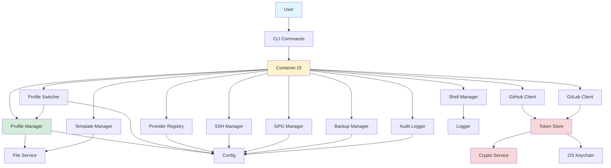

# Architecture Overview

This document describes GCM's architecture, design principles, component responsibilities, and key design patterns.

---

## Design Philosophy

1. **Single Responsibility** — Each package owns one domain concept (profiles, SSH, GPG, GitHub, etc.)
2. **Dependency Injection** — All services are wired through a central `Container`; no global state
3. **Testability** — Function-variable hooks allow mocking OS, terminal, keychain, and crypto at the package level
4. **Security by Default** — Tokens encrypted at rest, file permissions enforced, audit logging enabled
5. **User Experience First** — Interactive wizards, spinners, colored output, auto-switching on `cd`

---

## Architecture Layers

```
┌─────────────────────────────────────────────────┐
│                 cmd/gcm/main.go                 │  Entry point
├─────────────────────────────────────────────────┤
│                 internal/cli/                    │  Cobra commands
├─────────────────────────────────────────────────┤
│               internal/container/                │  Dependency injection
├──────────┬──────────┬──────────┬────────────────┤
│ profile/ │  ssh/    │  gpg/    │ provider/      │  Domain services
│          │          │          │ github/gitlab/ │
│          │          │          │  template/     │
│          │          │          │  backup/       │
│          │          │          │  shell/        │
│          │          │          │  audit/        │
├──────────┴──────────┴──────────┴────────────────┤
│            internal/service/                     │  Infrastructure
│            ├── crypto/   (AES-256-GCM, Argon2id) │
│            └── file/     (read, write, perms)    │
├─────────────────────────────────────────────────┤
│            internal/config/                      │  Configuration
│            (types, loader, defaults)             │
├─────────────────────────────────────────────────┤
│                    pkg/                          │  Shared utilities
│            ├── ui/       (prompts, tables)       │
│            ├── logger/   (structured logging)    │
│            └── version/  (build info)            │
└─────────────────────────────────────────────────┘
```

**Data flows top-down.** CLI commands depend on domain services, which depend on infrastructure services. The `pkg/` layer has no internal dependencies.

---

## Component Diagram



---

## Key Components

### Entry Point (`cmd/gcm/main.go`)

The `main()` function:
1. Loads configuration via `config.Load()`
2. Creates a `logger.Logger`
3. Builds the DI `container.New(cfg, log)`
4. Injects the container into CLI via `cli.SetContainer(ctr)`
5. Executes the root Cobra command

### CLI Layer (`internal/cli/`)

Each file maps to a top-level command:
- `root.go` — Creates the root `gcm` command and registers all subcommands
- `profile.go` — `gcm profile create|list|show|edit|delete|export|import|diff`
- `use.go` — `gcm use`, `gcm current`, `gcm refresh`
- `ssh.go` — `gcm ssh generate|list|test|copy`
- `gpg.go` — `gcm gpg generate|list|sign|test`
- `connect.go` — `gcm connect`, `gcm switch-provider`
- `github.go` — `gcm github login|login-oauth|login-gh|status|logout|verify|user`
- `gitlab.go` — `gcm gitlab login|status|logout|verify|user`
- `template.go` — `gcm template create|list|show|apply|import|export|delete`
- `backup.go` — `gcm backup create|list|restore|prune`
- `doctor.go` — `gcm validate`, `gcm doctor`
- `repair.go` — `gcm repair`, provider/profile consistency repair
- `credential_helper.go` — `gcm credential-helper get|store|erase` (hidden, called by git)
- `init_cmd.go` — `gcm init`
- `clean.go` — `gcm clean`
- `version_cmd.go` — `gcm version`
- `helpers.go` — Shared utilities (`formatTimeAgo`, `isStdinPiped`, `readStdinToken`)

The CLI layer is intentionally thin: parse flags → call domain service → format output.

### Container (`internal/container/`)

The `Container` struct holds all service instances. `New()` wires everything:

```go
type Container struct {
    Config          *config.Config
    Logger          *logger.Logger
    AuditLogger     *audit.Logger
    FileService     *fileSvc.Service
    CryptoService   *cryptoSvc.Service
    ProfileManager  *profile.Manager
    ProfileSwitcher *profile.Switcher
    SSHManager      *ssh.Manager
    GPGManager      *gpg.Manager
    GitHubClient    *github.Client
    GitLabClient    *gitlab.Client
    ProviderClient  *providerclient.Router
    ProviderRegistry *provider.Registry
    TokenStore      *tokenstore.TokenStore
    ShellManager    *shell.Manager
    TemplateManager *template.Manager
    BackupManager   *backup.Manager
}
```

### Domain Services

| Package            | Responsibility                                              |
| ------------------ | ----------------------------------------------------------- |
| `internal/profile` | CRUD, validation, switching, activation scopes, provider account invariants |
| `internal/ssh`     | Key generation (Ed25519/RSA/ECDSA), agent management, test  |
| `internal/gpg`     | Key generation, signing toggle, test signing                |
| `internal/provider`| Provider IDs, capabilities, host registry, credential username strategy |
| `internal/providerclient` | Provider-neutral API operation router for verify/upload/delete calls |
| `internal/github`  | GitHub OAuth device flow, PAT, gh CLI import, user/key APIs |
| `internal/gitlab`  | GitLab PAT verification and user/SSH/GPG key APIs |
| `internal/tokenstore` | Provider-neutral token persistence with keychain/encrypted/plain backends |
| `internal/shell`   | Shell detection, hook generation, install/uninstall         |
| `internal/template`| Template CRUD, import/export                                |
| `internal/backup`  | Create/restore/prune tar.gz backups                         |
| `internal/audit`   | JSONL audit logging                                         |
| `internal/config`  | Load/save config, default values, directory paths           |

### Infrastructure Services

| Package                   | Responsibility                              |
| ------------------------- | ------------------------------------------- |
| `internal/service/crypto` | AES-256-GCM encryption, Argon2id key derivation (primary), PBKDF2 (legacy), salt generation |
| `internal/service/file`   | Safe file R/W, path expansion, permissions, atomic writes |

### Shared Utilities (`pkg/`)

| Package       | Responsibility                                   |
| ------------- | ------------------------------------------------ |
| `pkg/ui`      | Prompts, confirmations, selects, spinners, tables, colors |
| `pkg/logger`  | Structured logging with levels and fields        |
| `pkg/version` | Build version info (populated via ldflags)       |

---

## Key Design Patterns

### Dependency Injection via Container

All services are created once in `container.New()` and injected into CLI commands via the package-level `ctr` variable. This avoids import cycles and allows testing with mock containers.

### Function-Variable Hooks for Testability

OS-level operations are wrapped in package-level function variables that tests can override:

```go
// production
var userHomeDirFn = os.UserHomeDir

// test
func TestSomething(t *testing.T) {
    old := userHomeDirFn
    defer func() { userHomeDirFn = old }()
    userHomeDirFn = func() (string, error) { return "/tmp/test", nil }
}
```

This pattern is used for:
- `os.UserHomeDir` / `os.Exit` in `config/types.go`
- `crypto/rand.Reader` in `service/crypto/service.go`
- `keyring.Set/Get/Delete` in `internal/tokenstore/token_store.go`
- `term.MakeRaw/Restore` in `pkg/ui/interactive.go`
- `term.ReadPassword` / `isTerminal` in `pkg/ui/prompt.go`

### Facade Pattern

The `Container` acts as a facade — the CLI layer doesn't need to know how services are constructed or interconnected.

### Strategy Pattern

Token storage uses three strategies selected at runtime:
1. **OS Keychain** — `keyring.Set/Get/Delete`
2. **Encrypted file** — AES-256-GCM with master password
3. **Plain-text file** — `0600` permissions, explicit `allow_plaintext_tokens` opt-in only

Shell hook generation uses a strategy per shell type (Bash, Zsh, Fish, PowerShell).

Provider integrations use a capability-based strategy. The registry resolves a Git credential host to a provider definition; CLI flows then call only the capabilities they need, such as PAT auth, credential helper support, SSH keys, or GPG keys. This keeps future Bitbucket support from requiring another CLI-wide rewrite.

Provider API calls go through `internal/providerclient.Router`. The router receives the provider definition and the token for each operation, so upload/delete/verify calls are token-scoped instead of relying on shared mutable client state. `providers.github` is the modern source of GitHub provider configuration; a customized legacy `github:` block is still honored when the provider entry is only the inherited default.

Provider-aware token APIs live in `internal/tokenstore`, not in any provider package. Provider clients receive tokens from the CLI/application flow and do not own persistence.

### Template Method

Profile activation (`Switcher.Activate`) follows a template: validate → scope-specific activation → increment usage → audit log.

---

## State Management

GCM manages state across several locations:

| State                 | Location                        | Persistence     |
| --------------------- | ------------------------------- | --------------- |
| Profiles              | `~/.gcm/profiles/*.yaml`       | Permanent       |
| Default profile       | `~/.gcm/config.yaml`           | Permanent       |
| Local profile pin     | `.gcm-profile` (in project)    | Per-directory   |
| Session profile       | Git config (overwritten)        | Until next `use`|
| Provider tokens       | `~/.gcm/tokens/`               | Encrypted       |
| Audit log             | `~/.gcm/logs/*.jsonl`          | Append-only     |
| Backups               | `~/.gcm/backups/*.tar.gz`      | Until pruned    |
| Templates             | `~/.gcm/templates/*.yaml`      | Permanent       |

---

## Error Handling Strategy

1. **Domain errors** — Custom `ProfileError` type with error codes, messages, and suggestions
2. **Wrapping** — `fmt.Errorf("context: %w", err)` for stack traces
3. **CLI layer** — Errors bubble up to Cobra's `RunE`, which prints them
4. **Audit logging** — Every auditable operation logs success *or* failure
5. **Graceful degradation** — Non-critical failures (e.g., SSH agent, usage counter) are logged as warnings, not fatal

### Error Categories

| Category | Handling | Example |
|----------|---------|---------|
| Validation errors | Return immediately with user-friendly message | Invalid profile name |
| File I/O errors | Wrap with context, return | Can't read config.yaml |
| External tool errors | Wrap with tool name, return | GPG failed |
| Network errors | Wrap with context, suggest retry | GitHub API timeout |
| Security errors | Return, never expose sensitive details | Decryption failed |

### ProfileError Type

```go
type ProfileError struct {
    Code       ErrorCode
    Message    string
    Suggestion string
}
```

Provides structured errors with actionable suggestions (e.g., `"Profile 'work' not found"` + `"Run 'gcm profile list' to see available profiles"`).

---

## Concurrency Model

GCM is single-process, single-goroutine for most operations. Concurrency appears in:

- **Audit logger** — Mutex-protected file writes (`sync.Mutex`)
- **GitHub polling** — `PollForToken` uses `context.Context` with deadline for timeout
- **Token store** — Mutex-protected master password cache

### Thread Safety

| Component | Mechanism | Notes |
|-----------|----------|-------|
| Audit logger | `sync.Mutex` | One log write at a time |
| Token store | Password cached in memory | Single-goroutine access |
| Config | Loaded once, read-only after | No mutex needed |
| Profile files | File-level locking via OS | One writer at a time |

---

## Performance Optimizations

- **Lazy loading** — Profiles loaded on demand, not on startup
- **Single config read** — `config.yaml` read once and passed through container
- **No network on startup** — GitHub API only called for explicit `github` commands
- **Native crypto** — SSH key generation uses Go stdlib, no subprocess
- **Minimal allocations** — YAML marshaling uses struct tags, avoiding reflection overhead
- **Shell hook fast-path** — `.gcm-profile` check exits immediately if file doesn't exist

---

## Internal Algorithms

### Profile Resolution

**`gcm use` scope selection:**
```
1. Check --local flag → write .gcm-profile + local git config
2. Check --global flag → write default_profile to config.yaml + global git config
3. Default → session scope (write .git/gcm-session marker + local git config)
```

**`gcm current` detection order:**
```
1. .git/gcm-session marker file → session
2. git config --local user.email matched against known profiles → session (fallback)
3. .gcm-profile in current directory → local
4. default_profile in config.yaml → global
```

> Session takes priority because `gcm use` is an explicit user action that should
> override a directory-level `.gcm-profile` pin.

### Token Storage Selection

```
1. use_keychain enabled? → try OS keychain
2. Keychain failed? → secure fallback only
3. encrypt_tokens + master_password? → AES-256-GCM encrypted file
4. allow_plaintext_tokens? → plain-text file (0600 permissions)
5. Neither? → fail closed
```

### Backup Archive Structure

```
gcm-backup-YYYY-MM-DD.tar.gz  # unencrypted
├── config.yaml
├── profiles/
│   ├── work.yaml
│   └── personal.yaml
└── templates/
    └── company.yaml
```

Each entry is extracted to a staging directory and validated against path traversal (zip-slip) before live files are replaced. Unsupported encrypted/key-inclusive backup settings fail closed.

---

## Security Architecture

See [Security Model](security.md) for the full threat model. Key points:

- **Tokens**: AES-256-GCM encrypted, Argon2id-derived keys (PBKDF2 legacy read-only), or OS keychain
- **SSH keys**: Generated with Go's native crypto, written `0600`, passphrases embedded in OpenSSH native format
- **GPG**: Batch input validated against injection (`%` and control characters rejected)
- **Backups**: Path-traversal (zip-slip) protection on restore
- **Audit**: Append-only JSONL log with timestamps
- **File permissions**: `0700` for sensitive directories, `0600` for sensitive files

---

## Testing Architecture

- **Unit tests**: Every package has `*_test.go` files; 90%+ coverage across all 15 packages
- **Hook-based mocking**: Function variables replace OS/terminal/keychain calls
- **Fake executables**: Shell scripts on PATH for SSH/GPG subprocess testing
- **Table-driven tests**: Most test functions use Go's `t.Run()` with subtests
- **No external test frameworks**: Pure `testing` + `t.Helper()`

### Function-Variable Hook Pattern

The core testing strategy. Each package exposes injectable function variables:

```go
// Production code
var execCommand = exec.Command
var readPassword = term.ReadPassword
var keyringSet = keyring.Set

// Test overrides
func TestSomething(t *testing.T) {
    original := execCommand
    execCommand = func(name string, args ...string) *exec.Cmd {
        return exec.Command("echo", "mock output")
    }
    defer func() { execCommand = original }()
    // ... test code
}
```

This avoids interfaces for mocking, keeps production code simple, and enables testing OS-level operations without actual side effects.

### Coverage by Package

| Package | Coverage | Key Testing Strategy |
|---------|---------|---------------------|
| `internal/profile` | 90%+ | Function hooks for file I/O |
| `internal/ssh` | 90%+ | Native Go crypto keygen, `ssh-add` error paths |
| `internal/gpg` | 90%+ | Fake `gpg` binary on PATH |
| `internal/github` | 90%+ | Hook HTTP client, fake keyring |
| `internal/config` | 90%+ | Temp directories, real YAML files |
| `internal/shell` | 90%+ | Temp shell config files |
| `internal/backup` | 90%+ | Temp directories, real tar.gz |
| `internal/audit` | 90%+ | Temp log files |
| `internal/template` | 90%+ | Function hooks for file I/O |
| `internal/container` | 90%+ | Constructor verification |
| `internal/cli` | 90%+ | Cobra command execution |
| `internal/service/crypto` | 90%+ | Round-trip encrypt/decrypt |
| `internal/service/file` | 90%+ | Temp files, permission checks |
| `pkg/logger` | 90%+ | Output capture |
| `pkg/ui` | 90%+ | Hook stdin/stdout |
| `pkg/version` | 90%+ | Struct verification |

---

## See Also

- [Project Structure](project-structure.md) — file-by-file map
- [Data Flow & Diagrams](data-flow.md) — operation traces
- [Dependencies](dependencies.md) — module justification
- [Security Model](security.md) — threat model and encryption details
