# Data Flow & Diagrams

This document traces how key GCM operations work end-to-end, with visual diagrams.

---

## System Overview

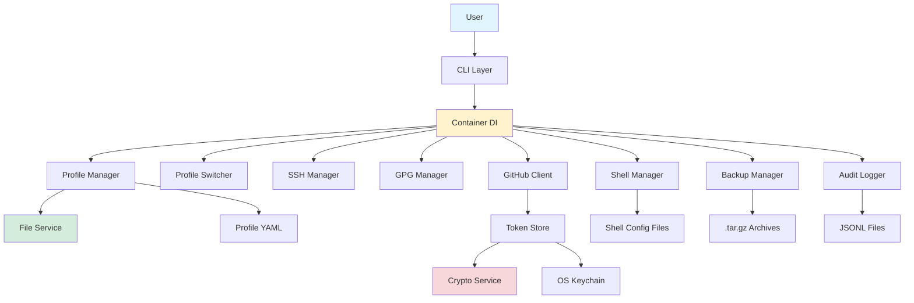

---

## Profile Creation Flow

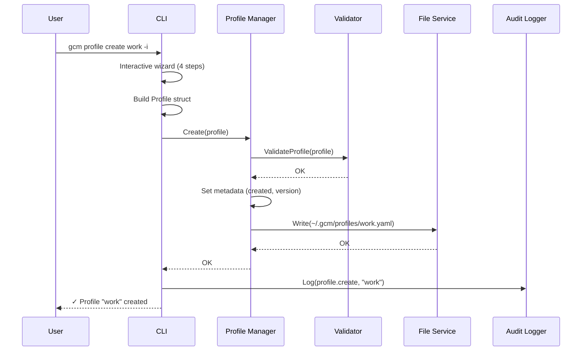

---

## Profile Activation Flow

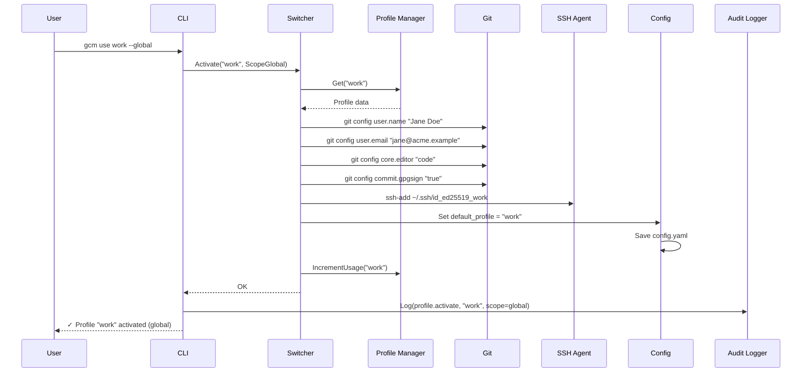

---

## Auto-Switch Flow (on `cd`)

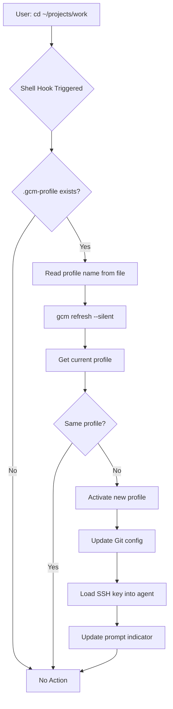

---

## SSH Key Generation Flow

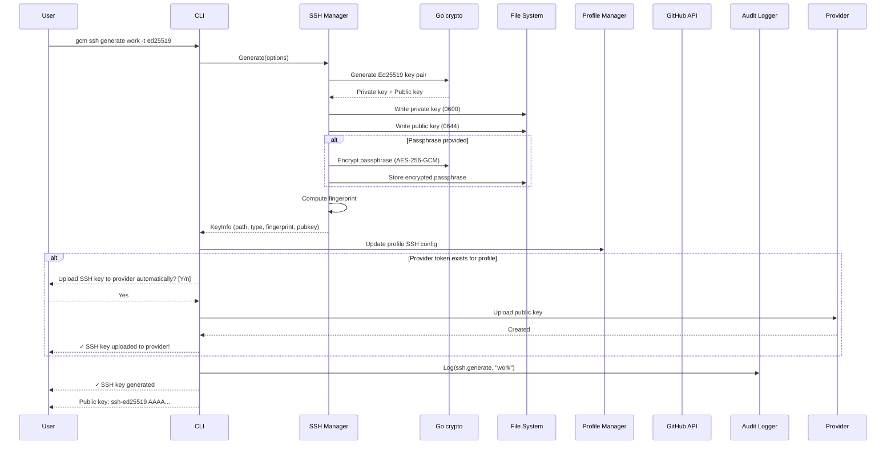

---

## GitHub Device Flow

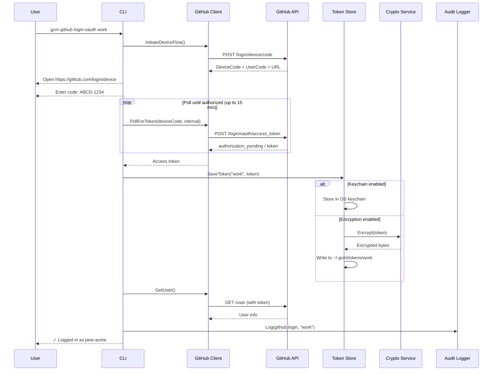

---

## Backup & Restore Flow

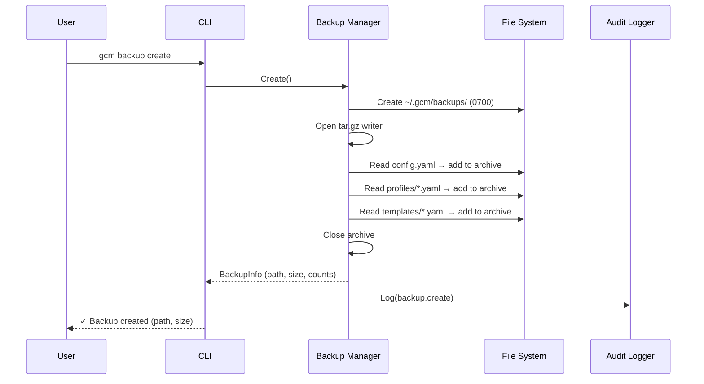

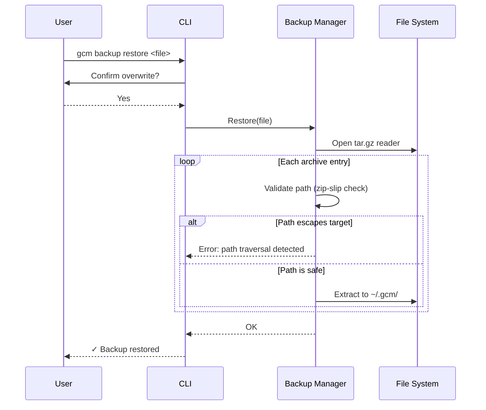

---

## Credential Helper Flow

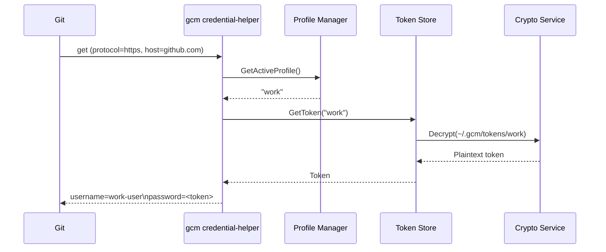

Git calls `gcm credential-helper get` whenever it needs HTTPS credentials for a configured provider host. GCM resolves the active profile, decrypts the provider-aware token from its own store, and returns it directly — bypassing the system keychain entirely.

---

## Shell Integration Install Flow

```mermaid
sequenceDiagram
    participant User
    participant CLI
    participant ShellMgr as Shell Manager
    participant FS as File System
    participant AuditLog as Audit Logger

    User->>CLI: gcm init
    CLI->>ShellMgr: DetectShell()
    ShellMgr->>ShellMgr: Check $SHELL env var
    ShellMgr-->>CLI: "zsh"
    
    CLI->>ShellMgr: Install("zsh")
    ShellMgr->>ShellMgr: Get config file (~/.zshrc)
    ShellMgr->>FS: Read ~/.zshrc
    ShellMgr->>ShellMgr: Check for existing markers
    
    alt Already installed
        ShellMgr-->>CLI: Error: already installed
    else Not installed
        ShellMgr->>ShellMgr: Generate hook code
        ShellMgr->>FS: Append to ~/.zshrc
        ShellMgr-->>CLI: Config file path
    end
    
    CLI->>AuditLog: Log(shell.init, shell=zsh)
    CLI-->>User: ✓ Shell integration installed
    CLI-->>User: Restart your shell
```

---

## Configuration Loading Flow

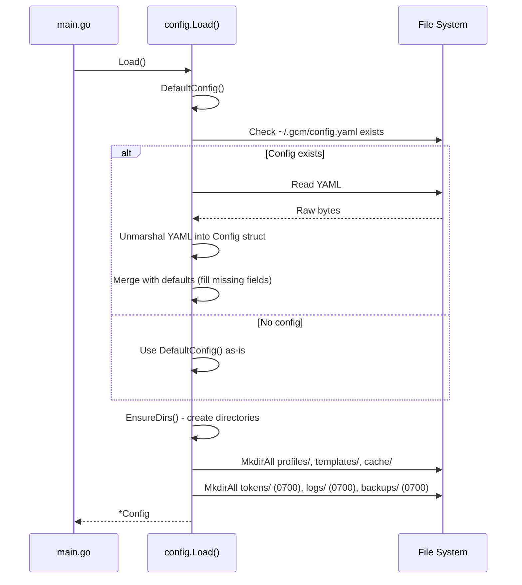

---

## Token Storage Decision Tree

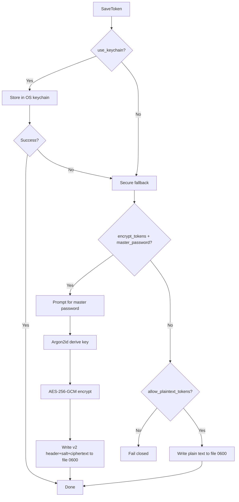

---

## Component Dependencies

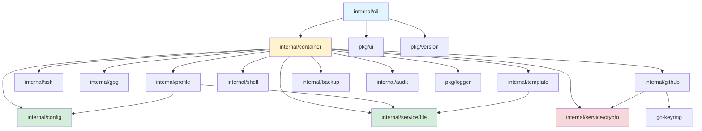

---

## State Machine: Profile Activation

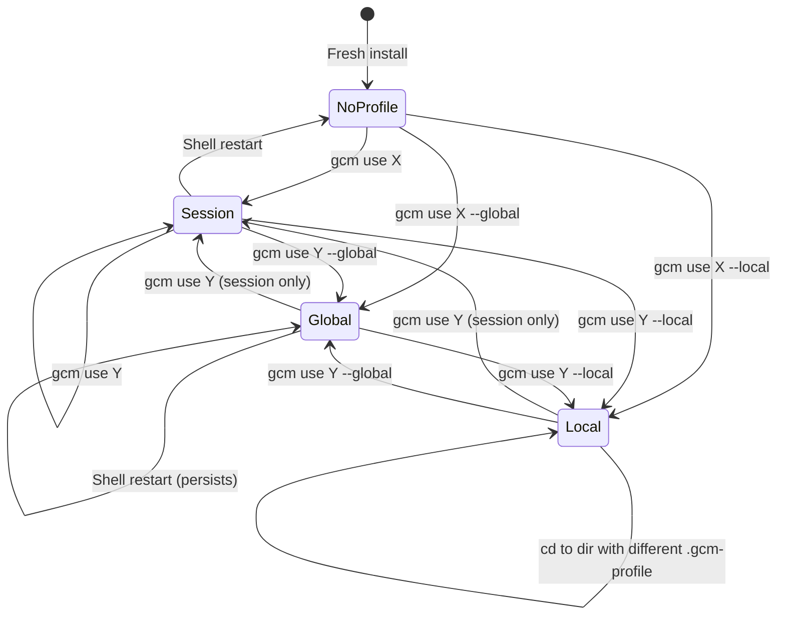

---

## File System Layout

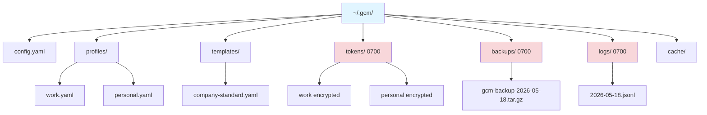

---

## See Also

- [Architecture Overview](architecture.md) — design patterns and principles
- [Project Structure](project-structure.md) — file-by-file map
- [Security Model](security.md) — encryption and permission details
