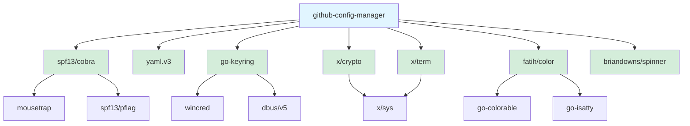

# Dependencies

This document lists every Go module dependency used by GCM, why it's needed, and its license.

---

## Overview

GCM keeps its dependency tree small. There are **7 direct dependencies** and **6 indirect (transitive) dependencies**. All dependencies are well-maintained, widely used Go modules.

---

## Direct Dependencies

### github.com/spf13/cobra `v1.10.2`

| | |
|-|-|
| **Purpose** | CLI framework — command parsing, flag handling, help generation, shell completions |
| **License** | Apache-2.0 |
| **Used by** | `internal/cli/*` |
| **Why** | Industry-standard Go CLI framework. Powers kubectl, Hugo, GitHub CLI, and thousands of other tools. Provides subcommand routing, flag parsing, help text, and shell completion generation. |

### gopkg.in/yaml.v3 `v3.0.1`

| | |
|-|-|
| **Purpose** | YAML parsing and generation |
| **License** | MIT / Apache-2.0 |
| **Used by** | `internal/config/`, `internal/profile/`, `internal/template/` |
| **Why** | All GCM configuration files (config.yaml, profiles, templates) use YAML format. yaml.v3 provides robust marshaling/unmarshaling with struct tags. |

### github.com/zalando/go-keyring `v0.2.8`

| | |
|-|-|
| **Purpose** | Cross-platform OS keychain access |
| **License** | MIT |
| **Used by** | `internal/github/token_store.go` |
| **Why** | Stores GitHub OAuth tokens securely in the OS credential store (macOS Keychain, Linux secret-service/D-Bus, Windows Credential Manager). Preferred over encrypted file storage. |

### golang.org/x/crypto `v0.51.0`

| | |
|-|-|
| **Purpose** | Argon2id key derivation, PBKDF2 (legacy), SSH key encoding |
| **License** | BSD-3-Clause |
| **Used by** | `internal/service/crypto/`, `internal/ssh/` |
| **Why** | Provides `argon2` for deriving AES keys from master passwords (token encryption, primary KDF), `pbkdf2` for backward-compatible decryption of legacy tokens, and `ssh` for key marshaling. Part of the official Go extended standard library. |

### golang.org/x/term `v0.43.0`

| | |
|-|-|
| **Purpose** | Terminal password input |
| **License** | BSD-3-Clause |
| **Used by** | `pkg/ui/prompt.go` |
| **Why** | `term.ReadPassword()` reads passwords without echoing to the terminal. Essential for master password input during token encryption. Part of the official Go extended standard library. |

### github.com/fatih/color `v1.19.0`

| | |
|-|-|
| **Purpose** | ANSI color output |
| **License** | MIT |
| **Used by** | `pkg/ui/`, `pkg/logger/` |
| **Why** | Provides cross-platform colored terminal output. Handles Windows ANSI compatibility and `NO_COLOR` environment variable. |

### github.com/briandowns/spinner `v1.23.2`

| | |
|-|-|
| **Purpose** | Terminal progress spinners |
| **License** | Apache-2.0 |
| **Used by** | `pkg/ui/spinner.go` |
| **Why** | Shows animated progress indicators during long-running operations (GitHub device flow polling, key generation). Includes many spinner styles and color support. |

---

## Indirect Dependencies

These are pulled in transitively by direct dependencies. GCM does not import them directly.

| Module | Version | Pulled by | Purpose | License |
|--------|---------|-----------|---------|---------|
| `github.com/inconshreveable/mousetrap` | v1.1.0 | cobra | Windows-only: detects if launched from Explorer | Apache-2.0 |
| `github.com/spf13/pflag` | v1.0.10 | cobra | POSIX flag parsing (extends stdlib `flag`) | BSD-3-Clause |
| `github.com/danieljoos/wincred` | v1.2.3 | go-keyring | Windows Credential Manager binding | MIT |
| `github.com/godbus/dbus/v5` | v5.2.2 | go-keyring | Linux D-Bus binding for secret-service | BSD-2-Clause |
| `github.com/mattn/go-colorable` | v0.1.14 | color | Windows ANSI color support | MIT |
| `github.com/mattn/go-isatty` | v0.0.22 | color | Detects if stdout is a terminal | MIT |
| `golang.org/x/sys` | v0.44.0 | term, crypto | OS-level system calls | BSD-3-Clause |

---

## Standard Library Usage

GCM makes extensive use of Go's standard library, avoiding external dependencies where possible:

| Package | Used For |
|---------|----------|
| `crypto/aes` | AES-256-GCM encryption for tokens and passphrases |
| `crypto/cipher` | GCM mode for authenticated encryption |
| `crypto/ecdsa` | ECDSA SSH key generation |
| `crypto/ed25519` | Ed25519 SSH key generation |
| `crypto/elliptic` | P-256 curve for ECDSA |
| `crypto/rand` | Cryptographically secure random number generation |
| `crypto/rsa` | RSA SSH key generation |
| `crypto/sha256` | Key fingerprint computation |
| `encoding/json` | Audit log JSONL format, GitHub API responses |
| `encoding/pem` | SSH key file encoding |
| `archive/tar` | Backup archive creation/extraction |
| `compress/gzip` | Backup compression |
| `fmt`, `os`, `path/filepath` | File I/O, path handling |
| `net/http` | GitHub API requests (device flow, user info) |
| `os/exec` | Git and GPG subprocess execution |
| `strings`, `regexp` | Input validation |
| `time` | Timestamps, timeouts, polling intervals |

---

## Dependency Graph



---

## Updating Dependencies

```bash
# Check for available updates
go list -m -u all

# Update all dependencies
go get -u ./...

# Tidy module file
go mod tidy

# Verify checksums
go mod verify
```

---

## Security Considerations

All dependencies are:
- Widely used in the Go ecosystem
- Actively maintained
- Licensed under permissive open-source licenses (MIT, Apache-2.0, BSD)

GCM runs `go mod verify` in CI to detect tampering with cached modules.

---

## See Also

- [Architecture](architecture.md) — how these modules fit together
- [Security Model](security.md) — encryption and credential storage details
- [Contributing](contributing.md) — adding new dependencies
